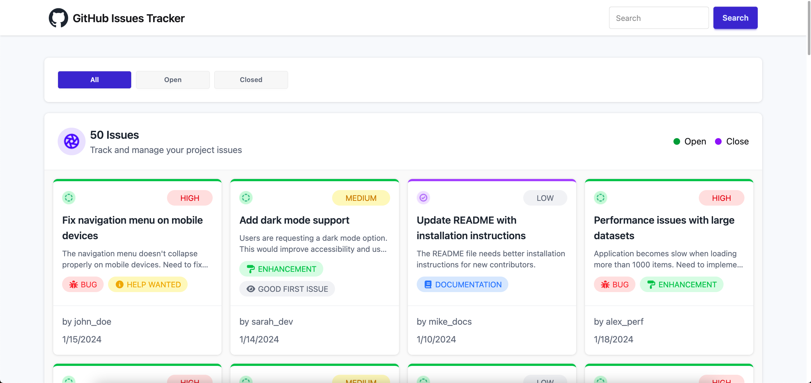

# GitHub Issue Tracker

## Project Overview

This project is a simple GitHub Issue Tracker web application. It provides users with a GitHub-like issue management system where issues can be viewed, filtered, searched, and detailed information can be seen.



## Main Technologies

- **HTML5**: To create the webpage structure
- **CSS3**: For styling and responsive design
- **JavaScript (ES6+)**: For interactivity and API calls
- **Tailwind CSS**: Utility-first CSS framework
- **DaisyUI**: Component library based on Tailwind CSS

## Main Features

- **Login System**: Simple username/password based login (Demo credentials: admin/admin123)
- **Issue Listing**: Display all issues with real-time updates
- **Status Filter**: Filter by All, Open, Closed status
- **Search Function**: Search issues by title or description
- **Issue Details**: View detailed issue information in modal (labels, priority, assignee, date)
- **Responsive Design**: Looks good on mobile and desktop

## Dependencies

This project uses the following external dependencies:

- **Tailwind CSS**: `https://cdn.jsdelivr.net/npm/@tailwindcss/browser@4`
- **DaisyUI**: `https://cdn.jsdelivr.net/npm/daisyui@5`
- **Font Awesome**: `https://cdnjs.cloudflare.com/ajax/libs/font-awesome/7.0.1/css/all.min.css`
- **Geist Font**: `https://fonts.googleapis.com/css2?family=Geist&display=swap`

## Local Machine Run Guidelines

1. **Clone the repository:**

   ```bash
   git clone https://github.com/rakib4kbd/B13-A5-Github-Issue-Tracker.git
   cd B13-A5-Github-Issue-Tracker
   ```

2. **Open the file:**
   - Open the `index.html` file in any browser (Chrome, Firefox, Safari, etc.)
   - Or use a local server (e.g., Live Server VS Code extension)

3. **Login:**
   - Username: `admin`
   - Password: `admin123`

4. **View issues:**
   - After login, issues will be visible on the main page
   - Use filter and search to find issues

**Note:** This application fetches data from an external API (`https://phi-lab-server.vercel.app/api/v1/lab/issues`). Internet connection is required.

## Links

- **Live Demo**: `https://rakib4kbd.dev/B13-A5-Github-Issue-Tracker/`
- **GitHub Repository**: `https://github.com/rakib4kbd/B13-A5-Github-Issue-Tracker`
- **API Documentation**: `https://phi-lab-server.vercel.app/api/v1/lab/issues`

## Contribution

If you want to contribute to this project:

1. Fork it
2. Create a feature branch
3. Submit a Pull Request

## License

This project is under the MIT License.
